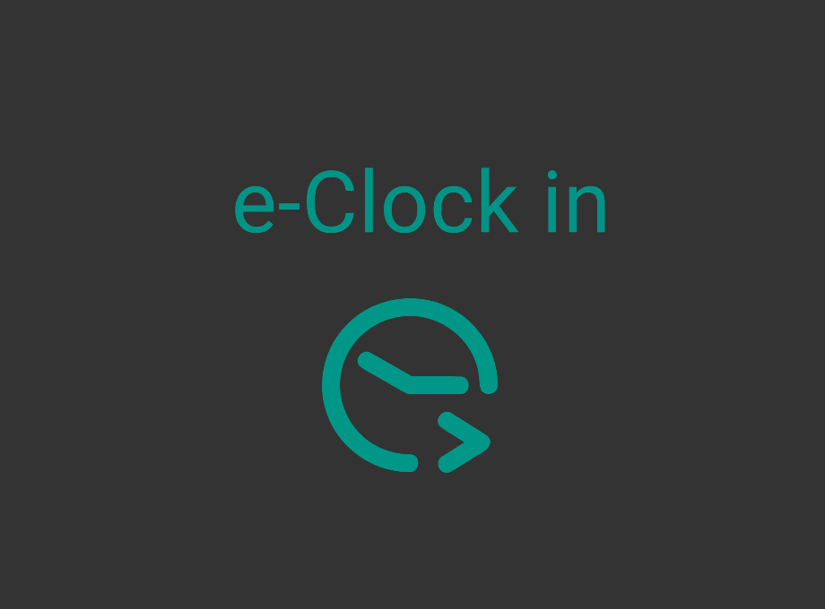
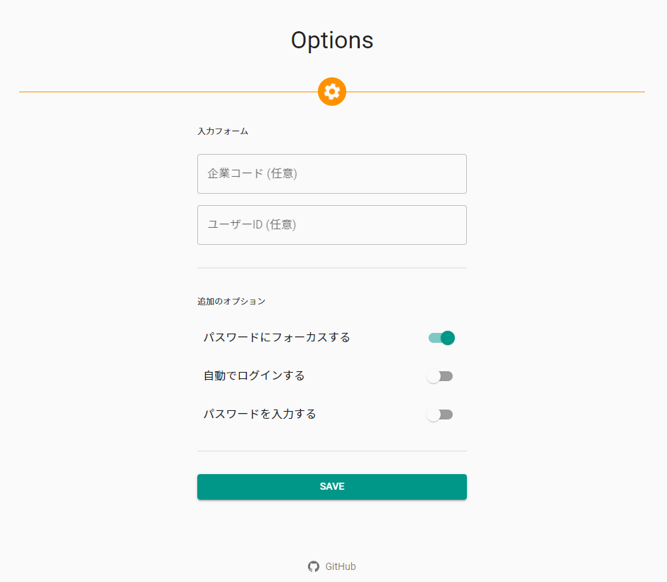
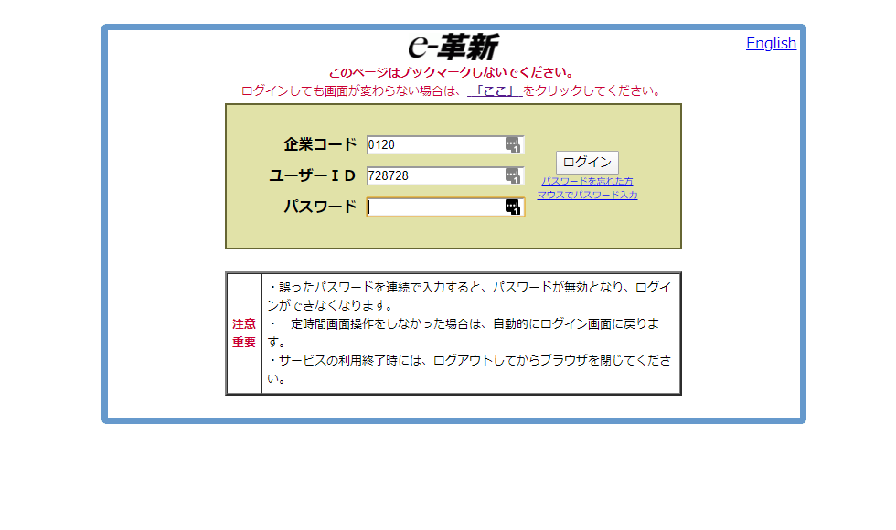

# e-Clock in

毎日の打刻を、より簡単に。

勤怠管理サービス「[e-革新](https://www.e-kakushin.com/login/)」のログインをサポートするChrome Extensionです。

## Features

毎日ユーザーIDを打ち込んでる？
パスワードマネージャーを使っているけど企業コードは入力してくれない？
安心してください、入ってますよ。

## Installation

[Chrome Web Store](https://chrome.google.com/webstore/detail/e-clock-in/ehgdbinldmgpdilamgemfibdhimdfljo)でインストールしてください。

## Usage

オプションで入力したいIDを設定して、いつも通り打刻しに行くだけで。

||
|:-:|

||
|:-:|

## License

* Code: MIT License
* Logos: CC BY-ND
* This project includes open source software.

## Disclaimer

* e-革新はセコムトラストシステムズ株式会社の登録商標です。
* このプロジェクトのディベロッパーはセコムトラストシステムズ株式会社とは一切関係ございません。
